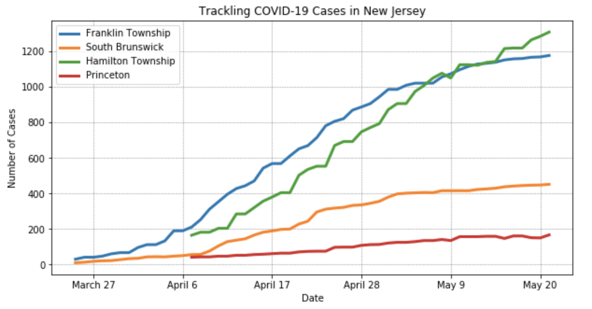
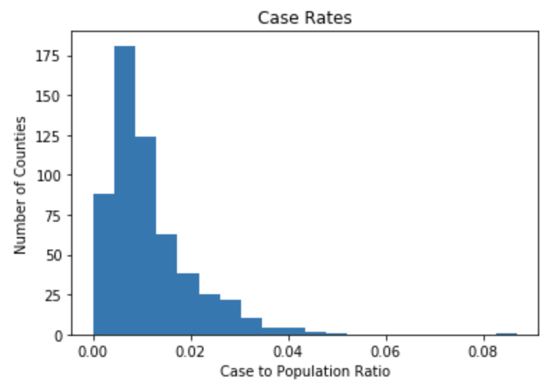
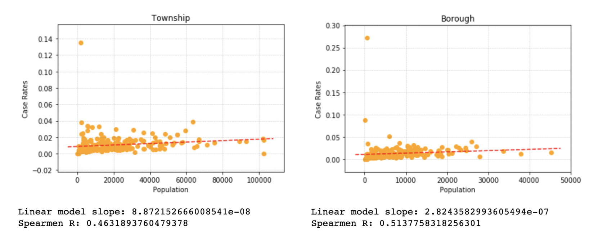
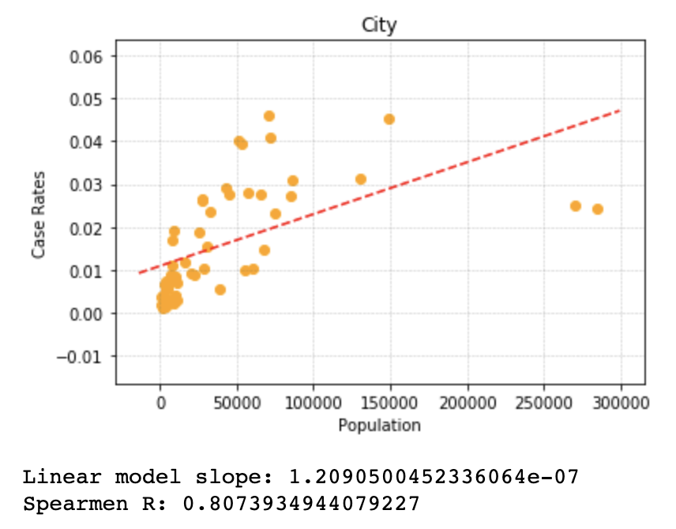
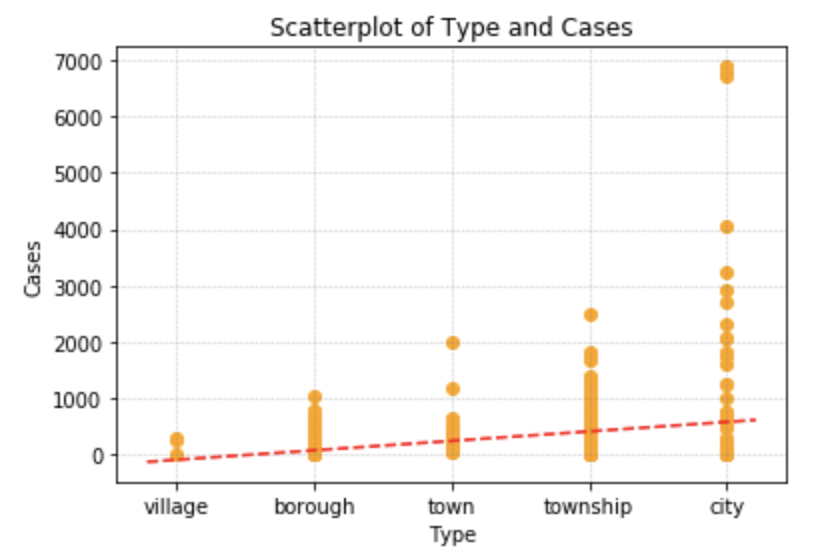
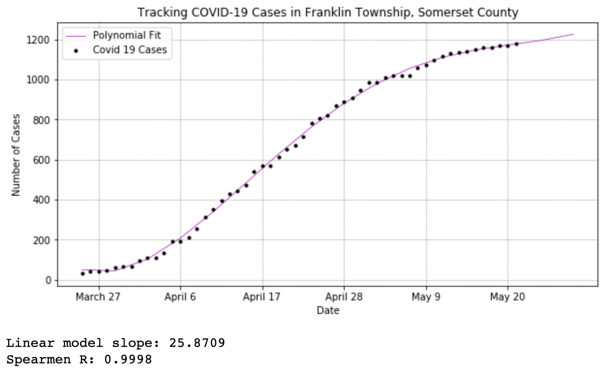
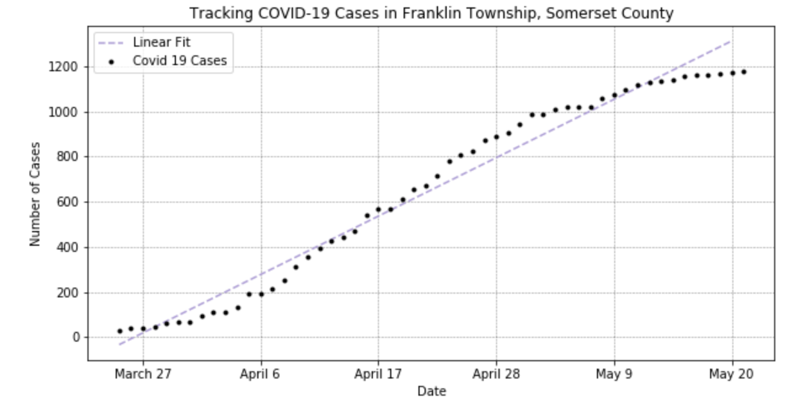

# Data Description and Breakdown

There are two datasets being using in this project:

- [`covid19-newjersey`](https://github.com/saaqebs/covid19-newjersey): An _ongoing_ data collection of the number of COVID-19 cases per New Jersey municipalities from March 25, 2020 to Present.

- [`municipal.csv`](./data/municipal.csv): Basic population statistics and which county they are a part of for each NJ municipality.

At the moment, these are the two main datasets being used. I may incorporate median income for each township if I am able to find a good dataset describing this.

Let's dive into these datasets!

## COVID-19 New Jersey Data

#### Overview

The scripts for automating and scraping the designated articles for this data is located in [another repository](https://github.com/saaqebs/covid19-newjersey). More information about the collection, automation, and notes can be found there. 

The data is collected and recorded by different counties in NJ, which is then compiled and posted in articles by [NJ.com](https://www.nj.com/coronavirus/). 

#### Data Observations and Attributes

After scraping the data from the article, it is stored in a CSV file format for an ongoing compilation of the number of cases per municipality in New Jersey. The structure of the file is as such:

| Municipal | County        | Cases | Date          |
|-----------|---------------|-------|---------------|
| allendale | bergen county | 4     | march-25-2020 |
| alpine    | bergen county | 1     | march-25-2020 |
| ...       | ...           | ...   | ...           |

The "Date" column is structured as `{month name}-{day}-{year}`. The "Municipal" and "County" variable contains the official municipality name with its corresponding county as posted in [`nj_municipals.json`](./data/nj_municipals.json). The "Cases" column is simply an integer indicating the number of cases.

#### Notes

As of April 26, all counties have been reporting township case numbers. However, some counties began disclosing the data later than other counties (eg. Atlantic and Mercer County), creating a discord in the data. 

There was no publication of data for May 1, 2020 on NJ.com. 

I recently found a bug where on 3 dates (5/8, 5/15, 5/21) where they split the data publishing into multiple days, affecting the automated data parsing. 

<!-- 

 -->

## New Jersey Municipality Data

#### Overview

This data contains some basic information for each municipality in New Jersey. 

The data is grabbed from this [Wikipedia Article](https://en.wikipedia.org/wiki/List_of_municipalities_in_New_Jersey)
and stored it in CSV file named `municpial.csv`. 

#### Data Observations and Attributes

After scraping the data from the Wikipedia entry, it is stored into a CSV file as such:

| Municipal  | County    | Population | Type     |
|------------|-----------|------------|----------|
| newark     | esssex    | 285154     | city     |
| edison     | middlesex | 102450     | township |
| somerville | somerset  | 12418      | borough  |
| ...        | ...       | ...        | ...      |

The attributes for this dataset is the "Municipal", "County", "Population", and "Type". The "Population" column is the estimated population of the municipality in 2017. The "Type" column contains whether this municipality is a "city", "township", "borough", etc.

#### Notes

I hope to expand this dataset and include a median income column for each municipality to further explore the analysis of COVID-19 cases in NJ.

## Data Scripts

There are three main Python Notebook files that have code that has been used to aggregate or analyze the data above. 

- [`Analytics.ipynb`](./Analytics.ipynb): Contains the preloaded data frames of the described datasets from above.

- [`NJMunicipalFullData.ipynb`](./scripts/NJMunicipalFullData.ipynb): Scrapes the Wikipedia entry for NJ Municipality data.

- [`NJCovid19Data.ipynb`](./scripts/NJCovid19Data.ipynb): Scrapes NJ.com article for COVID-19 cases for one day. I have a seperate script located in [this repository](https://github.com/saaqebs/covid19-newjersey) to automate the collection of data daily. 

More details can be found in those specific files.

## Significance

### Case Rates Brings Numbers Down to Earth

What was the most interesting to me was how the case rates in most municipalities (with the exception of 1 municipal at 25%) hovered at 1.5%. Since New Jersey only began testing asymptomatic cases last week, it makes sense that the positivity rate is extremely low. An observation regarding this is the fact how the standard deviation and variance for the case rate is extremely low (Variance is 0.02%!).

This shows while it is _extremely frightening_ to see a high number of cases Franklin Township  than in South Brunswick (452) (neighboring townships), the case rates for each  townships is still hovering around 1-2% (1.7% and 0.97% respectively).

  
<!--  -->

*Comparing Central Jersey case numbers. More specifically the difference between two neighboring towns: South Brunswick and Franklin Township.*

  
<!--  -->

*A histogram displaying the distribution of case rates.*

Further proving this is a histogram illustrating the distribution of case rates. The histogram excludes two outliers: Woodland Township (13.5%) and Rockleigh (27.1%). This histogram ultimately shows that most municipalities hover around 1% case rate.

One thing to note however is the fact that 1% of 45,000 (South Brunswick) is a much bigger number of people than 1% 67,000 people (Franklin Township). The difference is $670 - 450 = 220$ more people.

A prediction: With a massive increase of testing, the number of asymptomatic case being tested as positive will rise will cause the average case rate to rise up to 4% of the municipal's population.

### Case Rate and Municipality Type Relationship

Since COVID-19 is a respiratory disease, it only makes sense for denser populated areas to have a higher outbreak of the virus. This prompted me to analyze the relationship between case rate and the different types of municipalities. 

The analysis showed that Boroughs and Townships had low case rates regardless of populations. This may be a result of the nature of boroughs and townships; these types of municipalities have their populous spread across a large area, limiting the close interactions between groups of people.

  
<!--  -->

*Observing the relationship between Townships/Boroughs.*

The most promising is with City; the Spearmans's correlation is 0.80, showing that there some sort of correlation. In the figure below, it is quite clear that the two variables are positively correlated as the population increases. The curve is seemingly steeper with the extremely low populations, then does not increase as quickly with a much higher population.

  
<!--  -->

*The positively correlated case rates and population with the subgroup of municipalities of 'Cities' in New Jersey.*

All in all, these results are slightly significant because of the nature of these different types of municipalities that may have led to these rise in cases. Something to inspect in the future is the relationship between municipalities in North, Central, and South Jersey that may have affected the overall correlations between the populations and case rates.
### Number of Cases and Municipality Type Relationship

Aside from the relationships that were observed from the different municipalities and the case rate, one thing that was foreseen was how townships and boroughs had a seeingly constant relationship (without outliers). However, cities has a positive correlation between case rates and population. This begged the question of where the higher cases were coming from. 

As such, the graph below illustrates the number of cases plotted with their corresponding municipality type.

  
<!--  -->

*Inspecting the relationship between municipality type and the number of cases.*

The results seemingly show the effect that some of these municipality types may have on the number of cases. This phenonemon may be explained through possibly examining population density of each NJ municipality.

One thing to inspect in the future is the relationship between case rates and population density score; from observing the results from the 'Cities' chart, population density may play a role in affecting a higher case rate.

### Simple Mathematical Predictive Model

Using the historical dataset of each township from March 25, we could then use a purely mathematical model to fit and predict the rise (or fall) of cases in all of the municipalities. The figure below is an instance of a _purely_ mathematical mode being fitted onto the historical chart.

  
<!--  -->

*A mathematical model to predict the number of cases in Franklin Park Township for the next week.*

Since it is observable that the number of cases is falling, we should therefore see the model "stabilize" or "flatline". While this model seemingly falls in line with this hypothesis, the model is most likely off (by a lot).

The reason for this is through one simple phenomenon: _overfitting._ 

This model was trained and fitted over a polynomial with the highest degree of **four**. This suggest an extremely highly overfitted model, since I found that most machine learning experts rarely even use the cubic polynomial for modeling. 

However, the linear model is heavily underfitted, since it does not quantify the encorporation of social distancing measures implemented by New Jersey Government to combat the ongoing pandemic. 

 
<!--  -->

*An underfitted model predicting the growth in cases in Franklin Park Township.*

To combat these problems, the best way to correct these purely quantitative models is to include external qualitative (as well as quantitative) features to further enhance the quality of the predictive model. In my opinion, the current tragectory may fit a more logarithmic type graph than a polynomial.

## Conclusion

Overall, I am pretty confident on the conclusions I came across for these analysis. Some of the analytics were surprising, but there are many things that need to be further examined before making a definitive claim of why there are higher cases in certain New Jersey muncipalities than others. 

The predictive model is something that I want to personally explore more, since there are avenues that could be explored to further enhance the predictive model for New Jersey.

## Code: 

### Links: 
- [Data Source Repository](https://github.com/saaqebs/covid19-newjersey)
- [Analyitics Repository](https://github.com/saaqebs/analytics-coronavirus-nj/tree/info2950-final-project)

### Acknowledgements:
- [NJ.com/coronavirus](https://www.nj.com/coronavirus/)
- [Graphing with Slope-Intercept](https://stackoverflow.com/questions/7941226/how-to-add-line-based-on-slope-and-intercept-in-matplotlib)